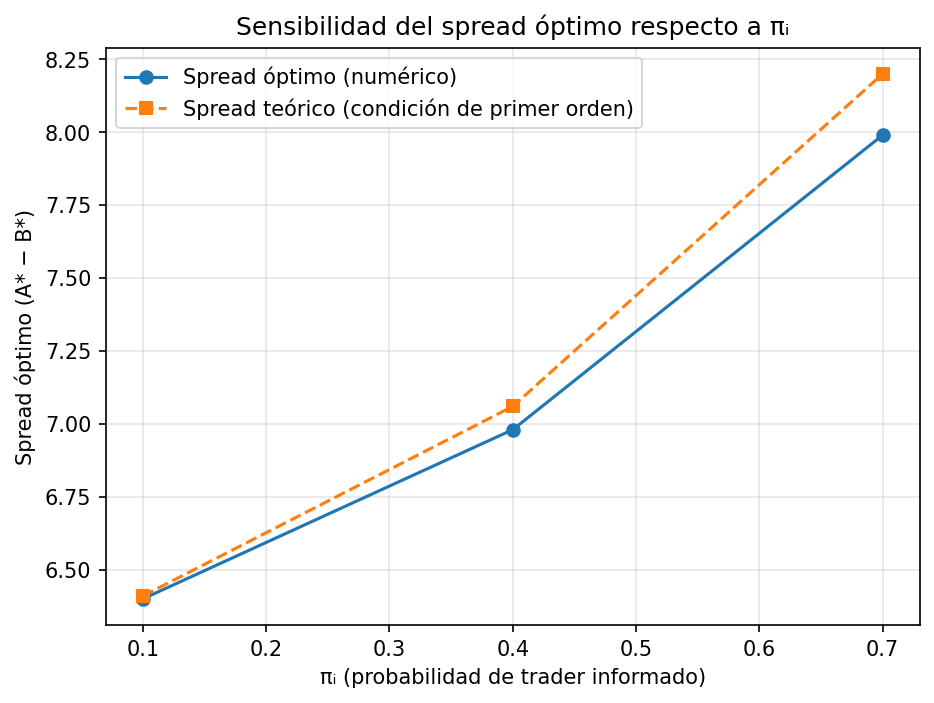

# Laboratorio 01: Modelo de Copeland y Galai (1983)

Laboratorio de la materia **Microestructura de Mercado** (ITESO) sobre el
modelo de asimetría de información de Copeland y Galai (1983), en el que el
formador de mercado (market maker) fija spreads bid-ask para protegerse del
riesgo de operar contra agentes informados.

## Estructura del proyecto

```
├── README.md
├── requirements.txt
├── .gitignore
├── main.py
├── src/
│   ├── model.py         # función de utilidad y optimización
│   ├── simulation.py    # simulador de trades
│   └── plots.py         # generación de figuras
├── tests/
│   └── test_model.py
├── notebooks/
│   └── analysis.ipynb   # análisis y figuras, importando funciones de src/
└── docs/                # material de la presentación (PDF)
```

## Instalación

```bash
python -m venv .venv
source .venv/bin/activate
pip install -r requirements.txt
```

## Uso
```bash
python main.py
```

## Parámetros Utilizados (sección 3.1)

| Parámetro                | Símbolo                  | Valor                | Descripción                                                          |
|---------------------------|---------------------------|-----------------------|-----------------------------------------------------------------------|
| Precio de referencia       | S₀                        | 19.90                | Estimación inicial del valor del activo                              |
| Distribución del valor     | P                          | Erlang(K=60, λ=3)     | Distribución del valor verdadero del activo                          |
| Prob. informado             | π_i                       | 0.40                  | Probabilidad de que el trader que llega esté informado                |
| Prob. liquidez              | π_L                       | 0.60                  | Probabilidad de que el trader sea de liquidez                        |
| Demanda no informada       | π_LB(s), π_LS(s)          | 0.50 − 0.08·s         | Probabilidad de ejecución, acotada inferiormente en cero              |

## 3.2 Fórmula Implementada (sección 3.2)
La función de utilidad esperada por trader que utilizamos en el proyecto fue es:

    Π(A,B) = π_L · [ π_LB(A−S₀)·(A−S₀) + π_LS(S₀−B)·(S₀−B) ]
             − π_I · [ ∫_A^∞ (P−A)·f(P) dP + ∫_0^B (B−P)·f(P) dP ]

## Simulación Monte Carlo (sección 3.3)

## Figuras Obligatorias (3.4)

## Análisis de sensibilidad (Sección 3.5)

Se reoptimizó el spread óptimo para πᵢ ∈ {0.1, 0.4, 0.7}, manteniendo π_L = 1 − πᵢ:

| πᵢ  | Spread óptimo (numérico) | Spread teórico (condición de primer orden) |
|-----|---------------------------|---------------------------------------------|
| 0.1 | 6.40                      | 6.41                                        |
| 0.4 | 6.98                      | 7.06                                        |
| 0.7 | 7.99                      | 8.20                                        |

El spread teórico se obtiene resolviendo la condición de primer orden derivada del propio modelo:

donde F es la CDF Erlang del valor verdadero del activo (ver `spread_teorico()` en `src/model.py`).

**Conclusión:** el spread óptimo crece de forma monótona con πᵢ, y el resultado numérico coincide con la condición teórica de primer orden con un error menor a 0.2 en todos los casos (atribuible a la tolerancia del optimizador `L-BFGS-B`). A mayor probabilidad de enfrentar un trader informado, el market maker necesita compensar esa pérdida marginal ensanchando el spread más allá del óptimo "monopolista puro".



## Pruebas (Sección 3.6)

`tests/test_model.py` contiene tres pruebas con pytest:

1. **`test_probabilidades_ejecucion_no_negativas`** — confirma que π_LB(s) y π_LS(s) nunca son negativas, incluso para distancias s grandes.
2. **`test_perdida_esperada_ask_decreciente_en_A`** — confirma que la pérdida esperada frente a informados decrece conforme A se aleja de S₀.
3. **`test_spread_optimo_monopolista_sin_informados`** — confirma que con πᵢ = 0, el spread óptimo por lado coincide con el resultado analítico del monopolista.

**Nota importante:** el enunciado del laboratorio indica que ese resultado analítico es s\* = 0.50/0.08 = 6.25. Al derivar la condición de primer orden de maximizar s·(0.50 − 0.08s), el máximo real está en s\* = 0.50/(2·0.08) = **3.125** por lado (6.25 es el punto donde la probabilidad de ejecución llega a cero, no el máximo de la ganancia esperada). La prueba usa el valor correcto, verificado contra la salida real del optimizador.


## Respuestas a las preguntas de análisis (Sección 4)

**¿Por qué los traders informados generan la necesidad de un spread?**

Con el régimen estrecho (Bid=19.75, Ask=20.05), el P&L promedio por trade fue −0.729 y el análisis de Monte Carlo da un P&L final promedio de −720.50 con 100% de probabilidad de pérdida. Un spread tan angosto no compensa al market maker frente a los traders informados, que operan solo cuando el precio verdadero está fuera del rango Bid/Ask y siempre a su favor.

**¿Cómo cambia el costo de selección adversa conforme se amplía el spread?**

La pérdida esperada en el Ask decrece de forma monótona y convexa conforme A se aleja de S₀:

| A     | Pérdida esperada |
|-------|-------------------|
| 19.90 | 1.078              |
| 20.90 | 0.655              |
| 21.90 | 0.370              |
| 22.90 | 0.195              |

**¿Cuál régimen acumula el mayor desbalance de inventario, y a qué riesgo lo expone?**

El régimen estrecho acumula el mayor desbalance de inventario (inventario final = −136, máximo |inventario| = 154 durante la corrida), muy por encima de óptimo (−43/43) y amplio (−117/149). Esto ocurre porque en el régimen estrecho casi todo el flujo proviene de traders informados con ventaja de información direccional, acumulando posición en la misma dirección trade tras trade. El modelo no captura el riesgo de mercado que esa posición desbalanceada expondría en la realidad —si el precio se mueve en contra antes de poder cerrarla— ni las restricciones de capital/margen que forzarían al market maker a ajustar su cotización mucho antes de llegar a ese nivel de exposición.

**¿Cómo se comporta el spread óptimo al variar πᵢ? ¿Coincide con la teoría?**

Crece de 6.4 a 7.99 conforme πᵢ sube de 0.1 a 0.7, y coincide con la condición de primer orden derivada del propio modelo (ver sección "Análisis de sensibilidad" arriba).

**Tres limitaciones del modelo para un formador de mercado real:**

1. No hay gestión de inventario ni costo de mantenerlo: el spread óptimo es fijo y no se ajusta según la posición acumulada.
2. πᵢ se asume constante y conocida, cuando en la realidad es incierta y cambia con el tiempo (por ejemplo, alrededor de eventos de noticias).
3. La simulación fuerza la ejecución de un trade en cada iteración, por lo que los resultados representan rentabilidad **por trade**, no rentabilidad **por unidad de tiempo**. Un spread muy amplio que casi nunca se ejecutaría en la realidad aparece favorecido bajo esta métrica.

## Uso de asistentes de IA

Se usó Claude (Anthropic) para: parametrizar `src/model.py` por πᵢ/π_L para permitir la reoptimización de la sección 3.5, derivar e implementar la condición de primer orden teórica usada como benchmark del spread óptimo, escribir las pruebas de `tests/test_model.py` de la sección 3.6 (incluyendo la corrección del punto teórico del monopolista), depurar errores de imports entre módulos del paquete `src`, unificar la ruta de guardado de las figuras generadas en `src/plots.py`, y redactar el borrador de las respuestas de la sección 4 a partir de los resultados numéricos obtenidos. Todo el código generado fue revisado, ejecutado y validado manualmente antes de integrarse al repositorio.


